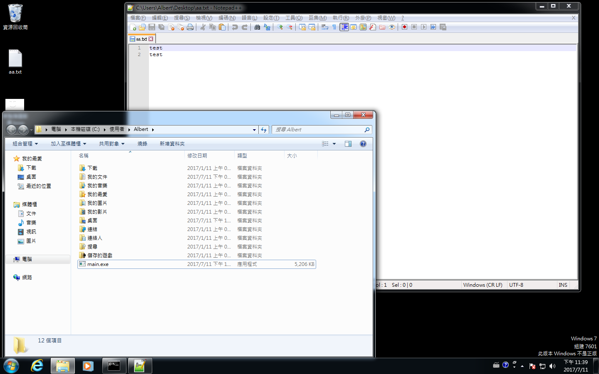
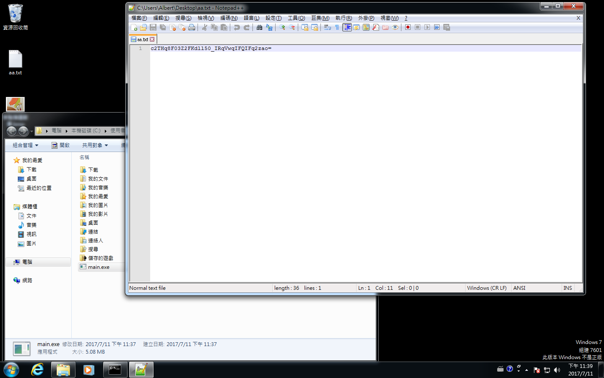

# Simple Golang Ransomware

> This is just a very simple ransomware PoC.

Before:

After:

## Feature

- Encryption key storage on Google form.

## Run & Build

Run:

`go run main.go`

Build:

`go build main.go`